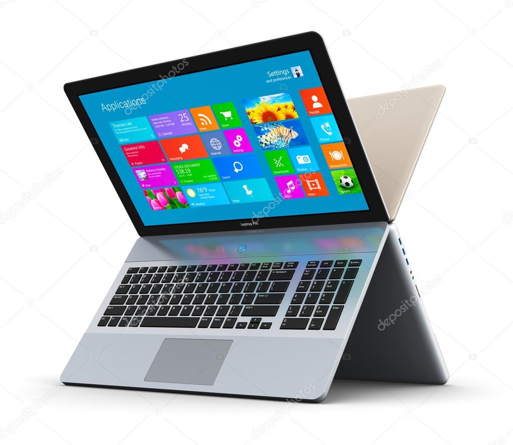

# TechProjects
Task of Web development internship given by TechnoHacks

🛍️ Product Card Design

📌 Overview

This project is a responsive product card designed using HTML & CSS. The card displays a product image, title, description, and price in a visually appealing layout. It is perfect for e-commerce websites, landing pages, and UI components.

🚀 Features

✅ Modern & Clean UI – Simple and professional design.

✅ Responsive Layout – Adapts to different screen sizes.

✅ Pure HTML & CSS – No external frameworks required.

✅ Hover Effects – Interactive styling for better UX.

✅ Reusable Component – Can be easily modified and integrated.

🛠️ Technologies Used

HTML5 – For structuring the product card.

CSS3 – For styling and responsiveness.

📜 Example Code

🖥️ Project Code (product3.html)
<!DOCTYPE html>
<html lang="en">
<head>
    <meta charset="UTF-8">
    <meta name="viewport" content="width=device-width, initial-scale=1.0">
    <title>Product Page</title>
    
</head>
<body>

    

        <!-- Laptop Product -->
        

            
            <h2>Modern Laptop</h2>
            
A high-performance laptop with sleek design and powerful specs.

            <h3 style="color: green;">Rs. 89,000</h3>
            
            <!-- Offer for Laptop -->
            
🔥 Flat 10% Off for First 50 Customers!

            
            <a href="#" class="buy-btn">Buy Now</a>
        

        <!-- Smartphone Product -->
        

            
            <h2>Latest Smartphone</h2>
            
A sleek and powerful smartphone with the latest features and AI technology.

            <h3 style="color: green;">Rs. 42,000</h3>
            
            <!-- Offer for Smartphone -->
            
🎁 Free Wireless Earbuds!

            
            <a href="#" class="buy-btn">Buy Now</a>
        

    

</body>
</html>

🔧 Future Improvements

🔹 Add "Buy Now" and "Add to Cart" buttons.

🔹 Improve mobile responsiveness with better styling.

🔹 Add animations and hover effects.

📢 Connect with Me

🔗 GitHub: https://github.com/Nikita18082003

🔗 LinkedIn: www.linkedin.com/in/nikita-borkar-790277270

